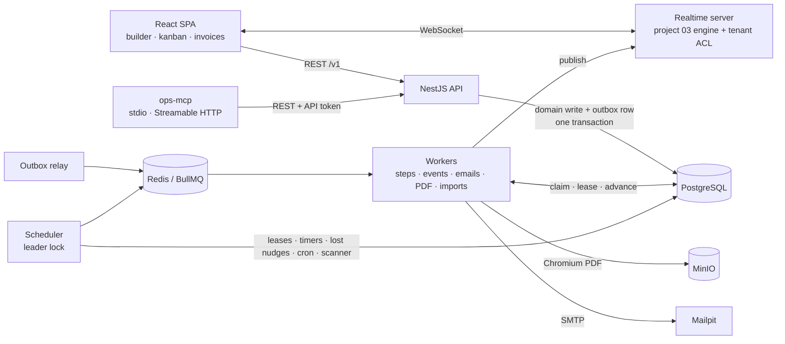

# Business Operations Platform

CRM, deals, invoices and tasks in one workspace — with a **durable workflow engine built from scratch** at its core: a visual builder, a typed expression language, and runs that survive crashes, restarts and Redis loss.


> "WHEN an invoice is overdue, IF the amount is above $1,000, THEN notify the account owner, create a task, send a reminder, wait 3 days for payment, ask a manager, send the final notice."

## Why this project

Business automations look simple until a worker dies mid-email, a timer has to fire in three days after two deploys, two branches finish at the same millisecond, or a workflow updates the record that triggered it. This project implements a small Temporal-style engine on Postgres and BullMQ and proves every guarantee with a failure test, plus the CRM, invoicing and UI that make the engine useful.

## Highlights

- **Durable execution from scratch.** Step state lives in Postgres; BullMQ jobs are only "nudges". Atomic claim (`UPDATE … WHERE status='pending' RETURNING *`), leases with heartbeats, a leader-elected scheduler that recovers expired leases, fires timers and re-nudges lost jobs.
- **At-least-once steps, effectively-once effects.** The idempotency key is `run:node:iteration` (no attempt number); emails are written to a mail outbox in the same transaction as the `effect_log` row. `kill -9` of the worker during `send_email` → the lease expires → another worker finishes → **exactly one email** in Mailpit (automated test).
- **Timers that survive restarts.** A 2-minute `wait_duration` fired **51–102 ms** after its due time (67 ms in the final run) although api, worker and scheduler were all stopped and restarted while it was waiting. `FLUSHDB` of Redis during 100 in-flight runs: all 100 completed.
- **A safe, typed expression language** (`@ashamrai/expr`): Pratt parser, type checker with `money`/`date`/`duration`, templates, SQL compilation for the condition scanner, autocomplete from your custom fields. No `eval`, no loops, bounded AST. 582 table tests, property round-trip and fuzzing, 63 SQL-vs-in-memory equivalence tests.
- **DAG workflows with joins, error edges, approvals and `for_each`**, versioned and pinned (a run on v1 finishes on v1 after v2 is published), protected from trigger loops by a causation chain.
- **Tenant isolation in the ORM.** A Prisma client extension scopes all 30 tenant models; a query without a tenant throws. Verified by 1,053 generated model × operation tests; raw SQL is forbidden by lint outside four tenant-filtered repositories.
- **Fair scheduling under a noisy neighbour.** Per-tenant run-creation rate limit (token bucket: `429` + `Retry-After` for API/webhook callers, deferred first steps for triggered runs), a per-tenant Redis semaphore that parks waiting steps instead of cycling them through the queue, and backlog-based job priority: while tenant A creates 5,000 runs, tenant B's step latency stays within 2× of idle (numbers below).
- **MCP server for AI agents** with risk metadata (`read` / `write_reversible` / `external` / `irreversible`), `dryRun`, `idempotencyKey` and `untrusted` field markers against prompt injection.
- **Hooks for the AI operator (project 06).** The `ai_step` node calls the HTTP endpoint in `OPERATOR_URL` (step idempotency key as `Idempotency-Key`, bearer `OPERATOR_TOKEN`, 5xx/429 retried, 4xx to the error edge; a deterministic fake provider is used when it is not set and in test runs). Record pages show an "Ask operator" slot that loads the operator's web component from `OPERATOR_EMBED_URL` (served to the SPA by `GET /v1/app-config`) and stays hidden otherwise.

## Architecture



A domain change writes the record and an outbox row in one transaction. The relay moves outbox rows into the `events` queue; consumers update the search index and timeline, create notifications, start `record_event` workflows and resume `wait_for_event` steps. A workflow step is claimed from Postgres, its config expressions are evaluated against a snapshot of the trigger record and the outputs of dominating steps, the handler performs its effect idempotently, and one transaction (holding the run row lock) stores the output and creates the next steps — joins included.

## Tech stack

| Layer         | Technology                                                                                              | Why                                                                                                            |
| ------------- | ------------------------------------------------------------------------------------------------------- | -------------------------------------------------------------------------------------------------------------- |
| API           | NestJS 11 + zod contracts                                                                               | Large domain with modules; zod schemas shared with the SPA and OpenAPI                                         |
| ORM / tenancy | Prisma 7 + client extension                                                                             | Tenant scoping in one place; compared with RLS in [ADR 0007](docs/adr/0007-tenant-scoping-prisma-extension.md) |
| DB            | PostgreSQL                                                                                              | Source of truth for runs and steps, FTS + trigram search, expression indexes for custom fields                 |
| Queue         | BullMQ on Redis                                                                                         | Nudges, delayed timers, priorities; never the source of truth                                                  |
| Expressions   | Own Pratt parser + type checker                                                                         | Safety, types, autocomplete, SQL compilation                                                                   |
| UI            | React 19, Vite, TanStack Router/Query/Table/Virtual, React Flow + elkjs, dnd-kit, CodeMirror 6, ECharts | Builder with live validation and replay, kanban, virtualised tables                                            |
| Realtime      | Project 03 engine + `@ashamrai/realtime-client`                                                         | Kanban moves, notifications, presence, live test runs                                                          |
| Flags         | `@ashamrai/flags-react` / `flags-node` (project 02)                                                     | `ai_step` and builder features behind flags, safe defaults when the relay is down                              |
| PDF / email   | Playwright Chromium worker, Nodemailer → Mailpit                                                        | Invoices laid out in HTML                                                                                      |
| MCP           | `@modelcontextprotocol/sdk`                                                                             | Typed tools for Claude Desktop, IDEs and the AI operator (project 06)                                          |

## Getting started

```bash
docker compose up --build        # Postgres, Redis, Mailpit, MinIO, api, 2 workers, scheduler, realtime, ops-mcp, web
open http://localhost:4511       # demo@demo.dev / demo1234
```

Without Docker (local Postgres 16+, Redis, Mailpit, MinIO):

```bash
pnpm install && pnpm build
bash scripts/dev-stack.sh start  # migrates, seeds, starts api :4500, worker, scheduler, realtime :4520
pnpm --filter @bop/web dev       # http://127.0.0.1:4510
```

Demo users (password `demo1234`): `demo@demo.dev` (owner), `manager@demo.dev`, `anna@demo.dev`, `ben@demo.dev`, `viewer@demo.dev`. The seed creates 20 companies, 48 contacts, 36 deals, 16 invoices, 18 tasks, custom fields and the 6 gallery workflows (published).

## Connect Claude Desktop in 1 minute

1. In the app: **Settings → API tokens → New token**, actor type _agent_, scopes `records:read`, `reports:read` (add `records:write` if you want tasks and notes). Copy the `bop_pat_…` value.
2. Build once: `pnpm --filter @bop/ops-mcp build`.
3. Add to `claude_desktop_config.json` (macOS: `~/Library/Application Support/Claude/claude_desktop_config.json`):

```json
{
  "mcpServers": {
    "business-ops": {
      "command": "node",
      "args": ["/absolute/path/to/apps/ops-mcp/dist/main.js"],
      "env": {
        "BOP_API_URL": "http://127.0.0.1:4500",
        "BOP_API_TOKEN": "bop_pat_..."
      }
    }
  }
}
```

4. Restart Claude Desktop and ask: _"Show overdue invoices above $1000"_. The server calls `list_invoices` with `overdueDays: 0, amountMinCents: 100000` and returns typed data.

Agents (project 06) use the Streamable HTTP transport instead: `node apps/ops-mcp/dist/main.js --http` → `POST http://127.0.0.1:4530/mcp` with `Authorization: Bearer <token>`.

| Tool                                                                                                                                    | Risk             |
| --------------------------------------------------------------------------------------------------------------------------------------- | ---------------- |
| `search_records`, `get_company`, `get_contact`, `get_deal`, `get_invoice`, `list_contacts`, `list_deals`, `list_invoices`, `get_report` | read             |
| `create_task`, `add_note`, `update_deal`, `draft_email`                                                                                 | write_reversible |
| `send_email`, `send_invoice`                                                                                                            | external         |
| `void_invoice`                                                                                                                          | irreversible     |

Every write tool accepts `idempotencyKey` and `dryRun`; a key is recorded once in `effect_log` (the same ledger the workflow engine uses, [ADR 0012](docs/adr/0012-one-effect-ledger-for-engine-and-api.md)). List tools page with `cursor` / `nextCursor`. Results list every field written by outside people in `untrusted` — web-form contacts and companies (also when nested in deals, invoices, tasks or search hits), inbound emails and external notes, the change history of such records and free-text search subtitles — e.g. `activities[2].data.body`, `items[4].contact.name`, `groups[0].hits[1].subtitle`. Search hits with equal scores come back in a stable order (score, title, id).

## Testing

| Level       | Command                 | What                                                                                                                                                                                                                                                                            |
| ----------- | ----------------------- | ------------------------------------------------------------------------------------------------------------------------------------------------------------------------------------------------------------------------------------------------------------------------------- |
| Unit        | `pnpm test`             | expression language (582 cases + property + fuzz), graph/join/validation logic, tenant argument scoping, retries, custom-field schemas, list planner, crypto, MCP catalogue, SPA components                                                                                     |
| Integration | `pnpm test:integration` | real Postgres/Redis/Mailpit with throwaway databases and key prefixes: tenant isolation over every model × operation, engine behaviour, the WORKFLOW_ENGINE §6 failure tests with real processes, raw-SQL tenant filters, HTTP API, MCP contract over Streamable HTTP and stdio |
| E2E         | `pnpm test:e2e`         | Playwright: CRM → won deal → onboarding workflow; builder from the overdue template → publish → Mailpit; approval inbox; two browsers kanban; dark mode; keyboard moves across off-screen kanban columns; run retry and cancel; "Ask operator" panel slot                       |
| Smoke       | `pnpm smoke`            | starts everything from production builds and walks CRM → workflows → Mailpit → MCP                                                                                                                                                                                              |
| Load        | `pnpm loadtest`         | 10,000 runs with 1/2/4 workers, noisy-neighbour comparison                                                                                                                                                                                                                      |

The failure tests from the engine spec:

| #   | Scenario                                             | Result                                                          |
| --- | ---------------------------------------------------- | --------------------------------------------------------------- |
| 1   | `kill -9` worker during `send_email`                 | lease expired, attempt 2 on another worker, exactly 1 email     |
| 2   | 10 identical BullMQ nudges                           | handler ran once, 10 jobs returned `not-claimed`                |
| 3   | 2-minute timer, full restart of api/worker/scheduler | fired 51–102 ms late (3 runs)                                   |
| 4   | Redis `FLUSHDB` with 100 runs in flight              | 100/100 completed, 100 tasks (no duplicates)                    |
| 5   | join race (both branches complete concurrently)      | join step created once in 15/15 runs                            |
| 6   | v1 run waiting, v2 published                         | finished on v1                                                  |
| 7   | "on deal updated → update deal"                      | 1 run; two mutually triggering workflows stop after 2 runs each |
| 8   | noisy neighbour: A creates 5,000 runs during B's run | B p95 9–13 ms under load vs 16–17 ms idle, ≤ 2× asserted        |
| 9   | expression language                                  | table, property, fuzz, SQL equivalence                          |

## Performance

Environment: one Apple Silicon laptop (8 cores, 8 GB RAM), Node 26.7, PostgreSQL 16 and Redis 8 on loopback, worker processes spawned by the load generator on the same machine, measured 2026-10-02/03 while other projects were running (1-minute load average 11–41, recorded per run). Method and raw JSON: [`loadtest/run.mjs`](loadtest/run.mjs), [`docs/benchmarks/`](docs/benchmarks), analysis in [ADR 0010](docs/adr/0010-fair-scheduling-and-query-budget.md).

**10,000 runs** (manual trigger → condition → create_task → end; 30,000 step executions), all enqueued before workers start, 16 concurrent steps per worker:

| Workers | Drain | Steps/s | Runs/s | SQL per step | Failed | Load avg |
| ------- | ----- | ------- | ------ | ------------ | ------ | -------- |
| 1       | 432 s | 69      | 23     | 11.6         | 0      | 27–29    |
| 2       | 153 s | 197     | 66     | 11.6         | 0      | 22–28    |
| 4       | 233 s | 129     | 43     | 11.8         | 0      | 34–41    |

1 → 2 workers scales; 4 workers on 8 shared cores is slower than 2 (CPU contention with Postgres and other processes).

**Bottleneck found and fixed:** a CPU profile showed ~45 % of worker CPU in the Prisma client runtime, proportional to the number of statements per step. Folding claim+read and lock+read into `UPDATE … RETURNING`, persisting the input with the completion, deriving run status from rows already loaded, and caching tenant metadata cut **22.3 → 11.6 SQL statements per step** and raised single-worker throughput **74 → 148 steps/s** (1,000 runs; the cache alone, measured back to back: 116 → 148).

**Noisy neighbour** (tenant A queues 5,000 runs, tenant B runs 20–30 one by one, B step latency created → finished):

| Scheduling                                                              | B p95 alone | B p95 while A has ~5,000 pending steps |
| ----------------------------------------------------------------------- | ----------- | -------------------------------------- |
| FIFO, semaphore checked after claiming in Postgres                      | 10–332 ms   | 1,680–6,431 ms                         |
| backlog priority + semaphore before the claim + adaptive re-nudge delay | 12–19 ms    | 57–93 ms                               |

The fix was not the priority itself but stopping throttled jobs of tenant A from being claimed in Postgres and bounced (three writes each, thousands per second).

**Noisy neighbour, round 2 (2026-10-05):** the spec scenario with tenant A _creating_ its 5,000 runs through the HTTP API while B is measured (idle baseline taken before and after A and pooled). Run creation is now rate-limited per tenant (token bucket, 50 runs/s, burst 500; API callers are paced up to 2 s, then `429` + `Retry-After`), waiting steps of a saturated tenant are parked in Redis and woken by releases instead of cycling through the queue, and authentication lookups are cached:

| Scenario (B step latency, created → finished)                           | B p95 idle | B p95 while A is active | Ratio     |
| ----------------------------------------------------------------------- | ---------- | ----------------------- | --------- |
| A creates 5,000 runs via the API, strict 429 limit (client retry storm) | 14–36 ms   | 58–558 ms               | 2.9–40    |
| A creates 5,000 runs via the API, paced (automated test, 4 runs)        | 16–17 ms   | 9–13 ms                 | 0.56–0.81 |
| A creates 5,000 runs in-process, paced (load test, 2 runs)              | 15–16 ms   | 6–10 ms                 | 0.40–0.63 |
| A with the limit disabled and 5,000 steps pre-queued (stress, 2 runs)   | 12–18 ms   | 42–43 ms                | 2.4–3.5   |

## Architecture Decisions

- [0001 Own workflow engine vs Temporal / n8n / Inngest](docs/adr/0001-own-workflow-engine.md)
- [0002 Postgres as source of truth, BullMQ as nudges](docs/adr/0002-postgres-source-of-truth.md)
- [0003 Leases with heartbeat](docs/adr/0003-leases-with-heartbeat.md)
- [0004 Idempotency key without attempt + effect_log](docs/adr/0004-idempotency-key-without-attempt.md)
- [0005 Own expression language vs JSONata / JSON Logic / isolated-vm](docs/adr/0005-own-expression-language.md)
- [0006 DAG with joins](docs/adr/0006-dag-with-joins.md)
- [0007 Tenant scoping: Prisma extension vs RLS](docs/adr/0007-tenant-scoping-prisma-extension.md)
- [0008 Runs work on a snapshot of the trigger record](docs/adr/0008-snapshot-trigger-record.md)
- [0009 Realtime through the project 03 engine](docs/adr/0009-realtime-through-project-03.md)
- [0010 Fair scheduling and the per-step query budget](docs/adr/0010-fair-scheduling-and-query-budget.md)
- [0011 NestJS without decorator metadata](docs/adr/0011-nestjs-without-decorator-metadata.md)
- [0012 One effect ledger for engine steps and API Idempotency-Key writes](docs/adr/0012-one-effect-ledger-for-engine-and-api.md)

Implementation details, verification log and deviations: [docs/IMPLEMENTATION_NOTES.md](docs/IMPLEMENTATION_NOTES.md).

## Known limitations & next steps

- Throughput is bounded by Postgres round-trips per step (11.6 statements per step after optimisation). Next: batch completion of steps, a stored procedure for "complete and advance", or a partitioned `step_runs` table.
- SMTP delivery is at-least-once (Message-ID = email id for receiver-side dedupe); exactly-once is guaranteed for the decision to send, not for the SMTP hop.
- No workflow history replay/patching like Temporal; running instances never migrate to new versions (by design).
- Tenant isolation is enforced in the application layer; RLS as a second layer would protect future raw SQL.
- `wait_for_event` checks the outbox for events that happened between run start and the wait, but events older than the run are not considered.
- Everything was measured on one shared laptop; numbers are conservative and noisy.
